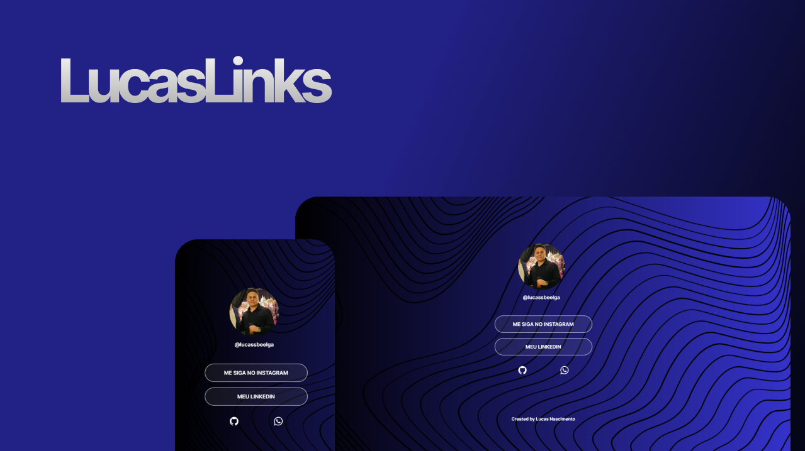

<h1 align="center"> LucasLinks </h1>

Um site de atalho para minhas redes e projetos.  
<a href="https://lp.rocketseat.com.br/devlinks/inscricao?utm_source=github&utm_medium=descricao&utm_campaign=capture-devlinks&utm_term=organic&utm_content=descricao-github-mayk-brito">Estude esse projeto em formato de vídeo clicando aqui.</a>

  <a href="#-tecnologias">Tecnologias</a>&nbsp;&nbsp;&nbsp;|&nbsp;&nbsp;&nbsp;
  <a href="#-projeto">Projeto</a>&nbsp;&nbsp;&nbsp;|&nbsp;&nbsp;&nbsp;
  <a href="#-layout">Layout</a>&nbsp;&nbsp;&nbsp;|&nbsp;&nbsp;&nbsp;
  <a href="#memo-licença">Licença</a>

  

 

  

## 🚀 Tecnologias

Esse projeto foi desenvolvido com as seguintes tecnologias:

- HTML e CSS
- Git e Github
- Figma

## 💻 Projeto

O LucasLinks foi um projeto que agregou links para um cartão de visitas online; Contendo atalhos para redes e contato direto comigo.

- [Acesse o projeto finalizado, online](https://LucassNascimentoo/lucas-project)

Created By [Lucas Nascimento](https://api.whatsapp.com/send/?phone=%2B5527999007373&text&type=phone_number&app_absent=0)
